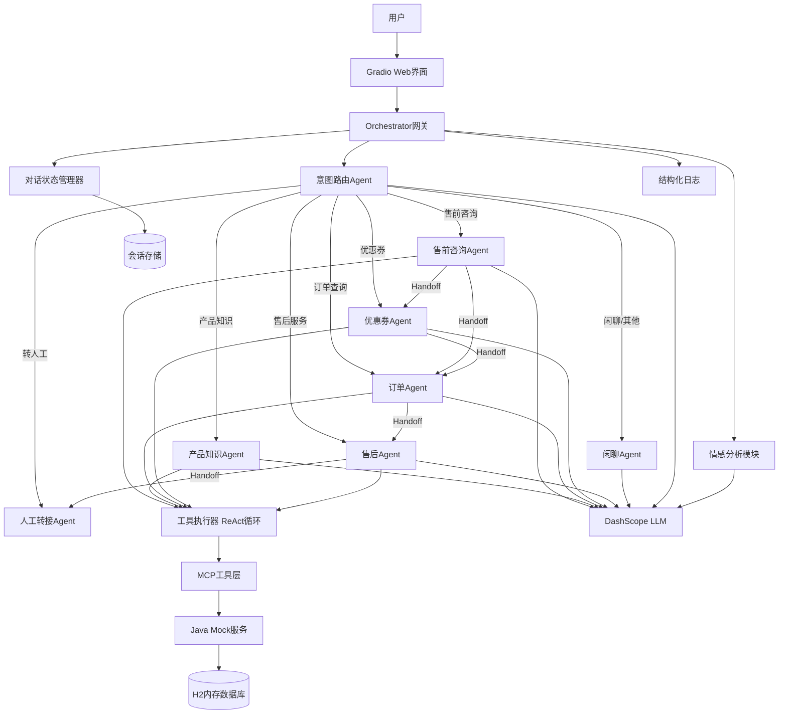
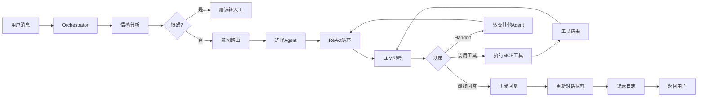
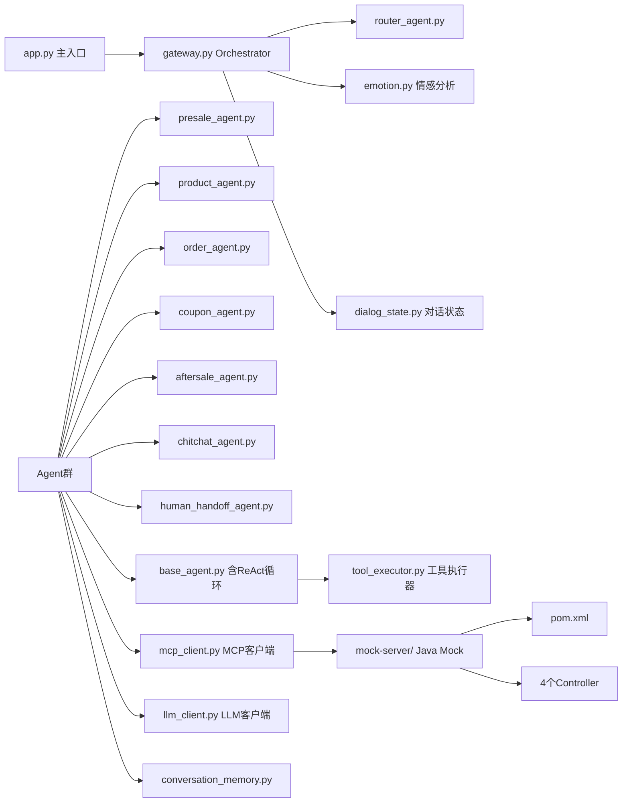

# AI电商客服系统 V2 - 架构设计

## 1. 系统架构图



## 2. 数据流图（ReAct循环）



## 3. 模块依赖图



## 4. 数据库设计

### Java Mock服务 - H2内存数据库

**products表**：
| 字段 | 类型 | 说明 |
|------|------|------|
| id | INTEGER PK | 商品ID |
| name | VARCHAR(200) | 商品名称 |
| category | VARCHAR(50) | 分类 |
| price | DECIMAL(10,2) | 价格 |
| stock | INTEGER | 库存 |
| description | TEXT | 描述 |
| specs | TEXT | 规格参数JSON |
| image_url | VARCHAR(500) | 图片URL |

**orders表**：
| 字段 | 类型 | 说明 |
|------|------|------|
| id | INTEGER PK | 订单ID |
| user_id | INTEGER | 用户ID（统一为整数） |
| product_id | INTEGER | 商品ID |
| product_name | VARCHAR(200) | 商品名称（冗余） |
| quantity | INTEGER | 数量 |
| total_price | DECIMAL(10,2) | 总价 |
| status | VARCHAR(20) | 状态(pending/paid/shipped/delivered/cancelled) |
| tracking_no | VARCHAR(50) | 物流单号 |
| tracking_company | VARCHAR(50) | 物流公司 |
| created_at | TIMESTAMP | 创建时间 |

**coupons表**：
| 字段 | 类型 | 说明 |
|------|------|------|
| id | INTEGER PK | 优惠券ID |
| code | VARCHAR(20) | 优惠码 |
| type | VARCHAR(20) | 类型(fixed/percent) |
| value | DECIMAL(10,2) | 面值/折扣 |
| min_purchase | DECIMAL(10,2) | 最低消费 |
| valid_until | TIMESTAMP | 有效期 |
| used | BOOLEAN | 是否已用 |
| user_id | INTEGER | 所属用户ID |

**after_sale_requests表**：
| 字段 | 类型 | 说明 |
|------|------|------|
| id | INTEGER PK | 售后ID |
| order_id | INTEGER | 订单ID |
| user_id | INTEGER | 用户ID |
| type | VARCHAR(20) | 类型(refund/exchange/repair) |
| reason | TEXT | 原因 |
| status | VARCHAR(20) | 状态(pending/approved/rejected/completed) |
| created_at | TIMESTAMP | 创建时间 |

**V2变更**：
- user_id统一为INTEGER类型（修复kefu中String/Integer不一致问题）
- orders增加product_name冗余字段（减少联表查询）
- orders增加tracking_no/tracking_company字段（支持物流查询）
- coupons增加user_id字段（支持按用户查询）
- products增加image_url字段

## 5. API接口契约

### Java Mock服务 REST API

#### 商品服务
```
GET /api/products
请求: ?category={category}&page=0&size=20
响应: {"items": [{"id":1,"name":"...","category":"...","price":99.00,"stock":100,"description":"...","specs":"{}","image_url":"..."}], "total": 6}

GET /api/products/{id}
响应: {"id":1,"name":"...","category":"...","price":99.00,"stock":100,"description":"...","specs":"{}","image_url":"..."}
错误: 404 {"error": "Product not found"}

GET /api/products/search
请求: ?query={keyword}
响应: 同GET /api/products格式
```

#### 订单服务
```
GET /api/orders
请求: ?user_id={userId}&status={status?}
响应: {"items": [{"id":1,"userId":1,"productId":1,"productName":"...","quantity":1,"totalPrice":99.00,"status":"shipped","trackingNo":"SF123456","trackingCompany":"顺丰","createdAt":"2026-05-01T10:00:00"}], "total": 4}

GET /api/orders/{id}
响应: 同上单个订单
错误: 404 {"error": "Order not found"}
```

#### 优惠券服务
```
GET /api/coupons
请求: ?user_id={userId}
响应: {"items": [{"id":1,"code":"SAVE10","type":"fixed","value":10.00,"minPurchase":50.00,"validUntil":"2026-12-31T23:59:59","used":false,"userId":1}], "total": 4}

GET /api/coupons/{code}
响应: 同上单个优惠券
错误: 404 {"error": "Coupon not found"}

POST /api/coupons/use
请求: {"code": "SAVE10", "user_id": 1}
响应: {"success": true, "message": "优惠券使用成功"}
错误: 400 {"error": "优惠券已使用/已过期"}
```

#### 售后服务
```
GET /api/aftersale
请求: ?user_id={userId}&order_id={orderId?}
响应: {"items": [{"id":1,"orderId":1,"userId":1,"type":"refund","reason":"...","status":"pending","createdAt":"2026-05-01T10:00:00"}], "total": 2}

POST /api/aftersale
请求: {"order_id": 1, "user_id": 1, "type": "refund", "reason": "商品有质量问题"}
响应: {"id": 3, "status": "pending", "message": "售后申请已提交"}

PUT /api/aftersale/{id}
请求: {"status": "approved"}
响应: {"id": 1, "status": "approved", "message": "售后状态已更新"}
错误: 404 {"error": "After-sale request not found"}
```

### MCP工具定义（8个工具）

```json
[
  {
    "name": "search_products",
    "description": "搜索商品，根据关键词或分类查找匹配的商品列表",
    "parameters": {
      "type": "object",
      "properties": {
        "query": {"type": "string", "description": "搜索关键词"},
        "category": {"type": "string", "description": "商品分类，如：手机、电脑、耳机"}
      },
      "required": ["query"]
    }
  },
  {
    "name": "get_product_detail",
    "description": "获取商品详细信息，包括规格参数、库存、价格等",
    "parameters": {
      "type": "object",
      "properties": {
        "product_id": {"type": "integer", "description": "商品ID"}
      },
      "required": ["product_id"]
    }
  },
  {
    "name": "query_orders",
    "description": "查询用户订单列表，可按状态筛选",
    "parameters": {
      "type": "object",
      "properties": {
        "user_id": {"type": "integer", "description": "用户ID"},
        "status": {"type": "string", "description": "订单状态筛选：pending/paid/shipped/delivered/cancelled"}
      },
      "required": ["user_id"]
    }
  },
  {
    "name": "get_order_detail",
    "description": "获取订单详情，包括物流信息",
    "parameters": {
      "type": "object",
      "properties": {
        "order_id": {"type": "integer", "description": "订单ID"}
      },
      "required": ["order_id"]
    }
  },
  {
    "name": "query_coupons",
    "description": "查询用户可用的优惠券列表",
    "parameters": {
      "type": "object",
      "properties": {
        "user_id": {"type": "integer", "description": "用户ID"}
      },
      "required": ["user_id"]
    }
  },
  {
    "name": "check_coupon",
    "description": "验证优惠码是否有效",
    "parameters": {
      "type": "object",
      "properties": {
        "code": {"type": "string", "description": "优惠码"}
      },
      "required": ["code"]
    }
  },
  {
    "name": "create_aftersale",
    "description": "创建售后申请（退款/换货/维修），需要用户确认",
    "parameters": {
      "type": "object",
      "properties": {
        "order_id": {"type": "integer", "description": "订单ID"},
        "user_id": {"type": "integer", "description": "用户ID"},
        "type": {"type": "string", "enum": ["refund", "exchange", "repair"], "description": "售后类型"},
        "reason": {"type": "string", "description": "申请原因"}
      },
      "required": ["order_id", "user_id", "type", "reason"]
    }
  },
  {
    "name": "query_aftersale",
    "description": "查询售后申请进度",
    "parameters": {
      "type": "object",
      "properties": {
        "order_id": {"type": "integer", "description": "订单ID"}
      },
      "required": ["order_id"]
    }
  }
]
```

## 6. 技术选型

| 组件 | 技术 | 理由 |
|------|------|------|
| AI Agent框架 | Python自研 | 轻量MVP，不依赖LangChain等重框架 |
| LLM | DashScope qwen-plus | 阿里云百炼，OpenAI兼容接口 |
| 意图路由 | LLM分类 + 情感分析 | 利用LLM理解能力做意图识别+情感判断 |
| Agent协作 | Handoff模式 | Agent间可转交对话+传递上下文 |
| 工具调用 | ReAct循环 | 支持多轮工具调用，直到收集足够信息 |
| 对话状态 | DialogStateManager | 维护槽位信息、当前Agent、对话阶段 |
| MCP客户端 | Python HTTP | 通过HTTP调用Java Mock服务模拟MCP |
| Mock后端 | Spring Boot 3.2 + H2 | Java生态标准，内嵌数据库无需安装 |
| Web界面 | Gradio | 快速搭建对话式UI + 满意度评价 |
| 对话记忆 | Python dict + TTL | 内存存储+过期清理，按session_id隔离 |
| 日志 | structlog | 结构化日志，便于追踪和调试 |

## 7. 多智能体通讯机制（V2核心升级）

### 7.1 Orchestrator编排器（替代简单Gateway）

Orchestrator是系统的中央控制器，负责：
1. 接收用户消息
2. 调用情感分析模块判断用户情绪
3. 调用Router Agent进行意图路由
4. 管理对话状态（DialogStateManager）
5. 协调Agent间的Handoff
6. 记录结构化日志

### 7.2 Handoff机制（V2新增）

Agent处理过程中可决定将对话转交给其他Agent：

```python
class HandoffRequest:
    target_agent: str       # 目标Agent名称
    reason: str             # 转交原因
    context: dict           # 传递的上下文（原始问题+已获取的数据+已生成的回复）
    original_message: str   # 原始用户消息
```

Handoff流程：
1. Agent A处理用户消息时，发现需要Agent B的能力
2. Agent A返回HandoffRequest而非最终回复
3. Orchestrator接收HandoffRequest，将上下文传递给Agent B
4. Agent B基于上下文继续处理，可再次Handoff或返回最终回复
5. 最多3次Handoff，防止无限循环

### 7.3 ReAct循环（V2核心升级）

每个专业Agent内部使用ReAct循环处理用户请求：

```
循环开始:
  1. Thought: LLM分析当前信息，决定下一步
  2. Action: 
     - 调用MCP工具 → 获取Observation → 回到1
     - Handoff到其他Agent → 返回HandoffRequest
     - 生成最终回答 → 返回用户
  3. Observation: 工具调用结果
  4. 判断: 信息是否足够？不够→回到1，足够→生成回答

最大循环次数: 5轮（防止无限循环）
```

### 7.4 对话状态机（V2新增）

```python
class DialogState:
    session_id: str
    user_id: int
    current_agent: str          # 当前活跃Agent
    dialog_phase: str           # 对话阶段: greeting/collecting/executing/confirming/closing
    slots: dict                 # 已收集的槽位信息
    pending_confirmation: dict  # 待确认的操作（如创建售后）
    handoff_history: list       # Handoff历史
    emotion: str                # 用户情绪: neutral/happy/angry/confused
    turn_count: int             # 当前对话轮次
```

对话阶段流转：
```
greeting → collecting → executing → confirming → closing
              ↑             ↓            ↓
              └───(信息不足)─┘    (用户确认)→executing
```

### 7.5 情感分析（V2新增）

在路由之前，先进行情感分析：
- 使用LLM判断用户情绪：neutral/happy/angry/confused
- 愤怒(angry)时：自动建议转人工，不强制路由到AI Agent
- 困惑(confused)时：使用更详细的解释风格
- 每轮对话都更新情感状态

### 7.6 槽位填充（V2新增）

当用户请求需要特定信息但未提供时，Agent主动追问：

| Agent | 必需槽位 | 追问示例 |
|-------|---------|---------|
| OrderAgent | user_id | "请问您的用户ID是多少？" |
| AftersaleAgent | order_id, type, reason | "请问是哪个订单需要售后？是退款、换货还是维修？" |
| CouponAgent | user_id 或 code | "请提供您的用户ID或优惠码" |

### 7.7 敏感操作确认（V2新增）

以下操作需要用户二次确认后才执行：
- 创建售后申请（create_aftersale）
- 使用优惠券（use_coupon）

流程：
1. Agent收集完槽位信息后，向用户展示确认信息
2. 用户确认后，Agent才调用MCP工具执行操作
3. 用户取消则放弃操作

## 8. 与kefu V1的关键差异

| 维度 | kefu V1 | kefu-z V2 |
|------|---------|-----------|
| 路由 | 单次Router分类 | Router + 情感分析 + 对话状态 |
| 工具调用 | 单轮工具调用 | ReAct循环（最多5轮） |
| Agent协作 | 完全隔离 | Handoff机制（最多3次） |
| Function Calling | 伪装user消息 | 标准role:"tool"消息 |
| 对话管理 | 无状态 | DialogStateManager + 槽位填充 |
| 敏感操作 | 直接执行 | 二次确认机制 |
| 情感识别 | 无 | LLM情感分析 |
| 人工转接 | 无 | HumanHandoffAgent |
| 日志 | 无 | structlog结构化日志 |
| 会话管理 | 无过期 | TTL + 容量控制 |
| 用户ID | String/Integer混用 | 统一Integer |
| 满意度评价 | 无 | 👍/👎评价 |
